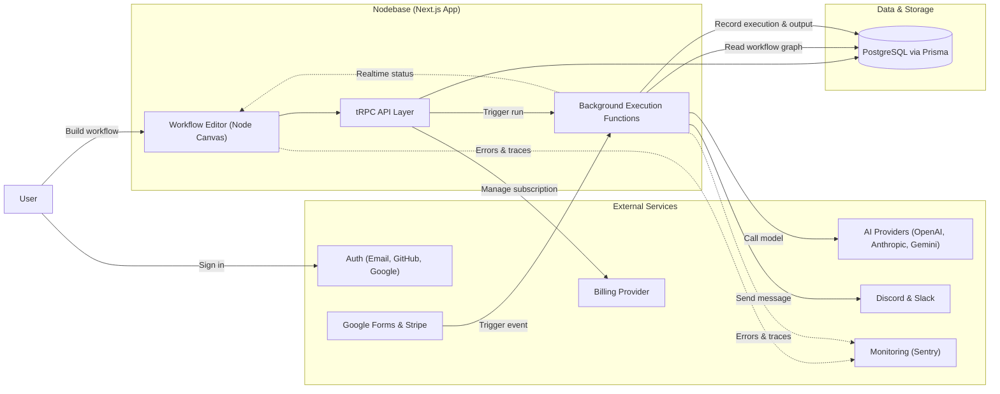

# Nodebase

> Visual workflow automation builder with AI, trigger and integration nodes, backed by durable background execution.

    

Nodebase is a full-stack workflow automation platform built with Next.js (App Router), React and TypeScript. Users design automations visually on a node-based canvas, connecting triggers (manual, HTTP, Google Forms, Stripe events) to actions (AI model calls, Discord, Slack) and running them reliably through a durable background job engine, with full execution history and encrypted credential storage.

## Features

- Visual workflow editor built on a node-based canvas, supporting drag-and-drop nodes and connections between steps
- Multiple trigger types: manual trigger, HTTP request, Google Form submissions, Stripe events
- AI nodes powered by multiple providers (OpenAI, Anthropic, Google Gemini)
- Integration nodes for Discord and Slack notifications
- Encrypted credential storage per integration, reusable across workflows
- Durable background execution engine with real-time status updates as workflows run
- Full execution history with status (running / success / failed), errors and step output
- Authentication via email plus GitHub and Google OAuth
- Subscription/billing management
- Error tracking and monitoring

## Tech stack

| Layer | Technology |
| --- | --- |
| Framework | Next.js 16 (App Router), React 19, TypeScript |
| Workflow canvas | React Flow (`@xyflow/react`) |
| API layer | tRPC + TanStack Query |
| Background jobs | Inngest (durable execution + realtime) |
| AI integration | Vercel AI SDK (OpenAI, Anthropic, Google Gemini) |
| Database | PostgreSQL with Prisma ORM |
| Auth | Better Auth (email + GitHub/Google OAuth) |
| Billing | Polar |
| Error tracking | Sentry |
| Styling / UI | Tailwind CSS, Radix UI, shadcn-style component library |

## Architecture & flow



1. Users sign in (email or GitHub/Google OAuth) and build automations visually on the workflow canvas, connecting trigger, AI and integration nodes.
2. Workflow definitions (nodes, connections, positions) are persisted through a type-safe API layer backed by PostgreSQL via Prisma.
3. A workflow run starts either from a manual action in the UI or from an external trigger, such as an HTTP request, a Google Form submission, or a Stripe event.
4. Each run is executed as a durable background function, which reads the workflow graph, resolves the node execution order and calls the appropriate step: an AI provider, or an integration such as Discord or Slack.
5. Execution progress and results are streamed back to the editor in real time and persisted as an execution record, including status, errors and output for later inspection in the execution history.
6. Credentials required by nodes are stored encrypted and only decrypted at execution time inside the background job.

## Project structure

```
src/
├── app/                     # Next.js App Router routes
├── components/              # Shared UI components
├── config/                  # App-wide configuration
├── features/
│   ├── auth/                # Sign in / sign up
│   ├── credentials/         # Encrypted credential management
│   ├── editor/               # Workflow canvas (nodes, connections, node selector)
│   ├── executions/           # Execution history & status
│   ├── subscriptions/        # Billing
│   ├── triggers/             # Trigger-specific UI (Google Form, Stripe, etc.)
│   └── workflows/            # Workflow CRUD & listing
├── hooks/                    # Custom React hooks
├── inngest/
│   ├── client.ts             # Background job client setup
│   └── functions.ts          # Durable workflow execution functions
├── lib/                       # Shared utilities
└── trpc/                      # API router & client setup
prisma/
└── schema.prisma             # Database schema
```

## Data model (simplified)

- **Workflow** — belongs to a user, contains nodes, connections and executions.
- **Node** — a step in a workflow (trigger, AI provider or integration), with its position on the canvas and configuration data; optionally linked to a credential.
- **Connection** — a directed edge linking one node's output to another node's input, defining execution order.
- **Credential** — an encrypted value tied to an integration type, reusable across nodes.
- **Execution** — a single run of a workflow, tracking status, timing, error details and output.


## Available scripts

| Script | Description |
| --- | --- |
| `dev` | Starts the Next.js development server |
| `build` | Builds the app for production |
| `start` | Runs the production build |
| `lint` | Runs linting checks |
| `format` | Formats the codebase |
| `db:migrate` | Runs database migrations |
| `db:generate` | Generates the Prisma client |
| `db:studio` | Opens Prisma Studio |
| `inngest:dev` | Runs the background job development server |
| `dev:all` | Runs the app and background job server together |
